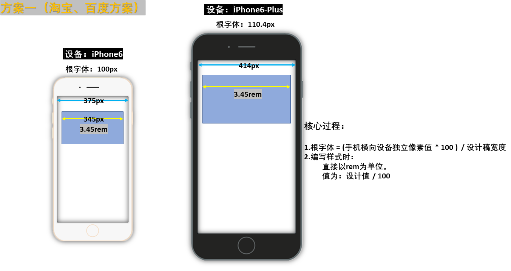
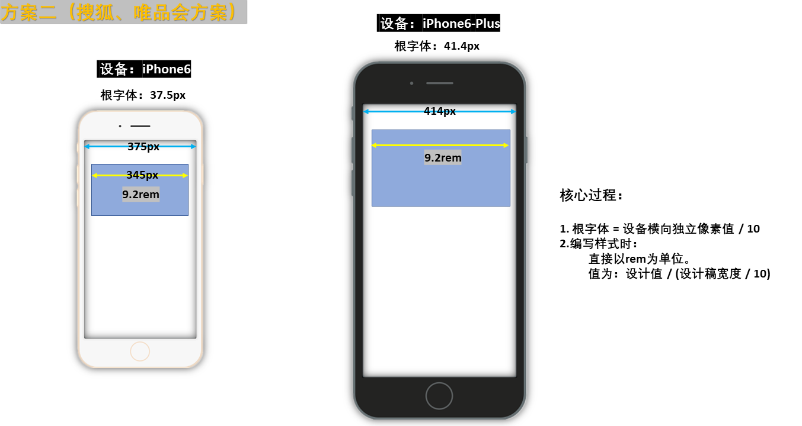

<script setup>
import ViewportDemo from "./components/ViewportDemo.vue";
import SeckillStackblitz from "./components/SeckillStackblitz.vue";
</script>

# 移动端适配

> [案例层] 这一篇聚合移动端适配的整条主线：怎么选型、`rem` 两种流派与手淘演进、张鑫旭的动态根字号最佳实践、纯 `vw` 活动页、Vue 工程接线，以及移动端专属的坑。底层单位概念见[单位与等比还原](./units-and-scaling.md)；本篇假设你已了解像素 / DPR / 三视口 / `meta viewport`，这些移动端背景概念见[像素与视口](./pixels-and-viewport.md)。触摸事件、点击穿透、真机调试不属于适配，在 `client_mobile`。

## 三类适配方案

移动端适配本质就三套思路，先建立全局认知，再按页面性质对号入座（见下方[选型](#选型)）：

| 方案类型     | 怎么做                                                                       | 适用                                       | 本页详解                                                                                      |
| ------------ | ---------------------------------------------------------------------------- | ------------------------------------------ | --------------------------------------------------------------------------------------------- |
| **`rem` 系** | JS 按屏宽动态设根字号，样式用 `rem` 等比缩放                                 | 已有 REM 体系的旧 H5；理解适配演进绕不开   | [rem 适配](#rem-适配-两种流派与手淘演进)                                                      |
| **`vw` 系**  | 用 `vw` 直接表达尺寸、零 JS，分「`vw` + `calc` 动态根字号」与「纯 `vw`」两支 | 动态根字号是新项目首选；纯 `vw` 适合活动页 | [动态根字号](#动态根字号-移动端适配最佳实践-张鑫旭-7-3-2) · [纯 vw](#纯-vw-活动页-海报-7-3-3) |
| **响应式系** | 流式 + Flex / Grid + 少量媒体查询断点，布局系统优先                          | 常规业务 H5、内容型，一套页面要兼顾到 PC   | [通用响应式方案](./general-responsive.md)                                                     |

一句话抓住区别：**`rem` / `vw` 是「等比缩放」**（整体还原设计稿比例），**响应式是「布局重排」**（按宽度换布局）。现代项目常以响应式打底，再对需要精确还原的区块叠加 `vw`。

## 选型

移动端不是只有一种适配方式，先按页面性质选：

| 页面性质                             | 方案                                                                     | 说明                           |
| ------------------------------------ | ------------------------------------------------------------------------ | ------------------------------ |
| 常规业务 H5（内容型、长期维护）      | [通用响应式方案](./general-responsive.md)（流式 + Flex/Grid + 少量断点） | 不必强求等比，布局系统优先     |
| 一套页面手机到 PC 都不乱、重阅读体验 | **动态根字号**（`rem` + `vw` + `calc`）                                  | 张鑫旭 7.3 最佳实践，下文重点  |
| 强视觉还原的活动页 / 海报（短期）    | 纯 `vw`（配 `postcss-px-to-viewport` 工程化）                            | 1:1 复刻设计稿，改版成本高     |
| 已有 REM 体系的旧 H5                 | `rem` 动态根字号（`flexible.js` 或 `÷100` 脚本）                         | 维护期方案，新项目优先上面两种 |

国内设计师常以 iPhone 6 为基准，交付 `750 * 1334` 设计稿。基础视口（细节见[像素与视口](./pixels-and-viewport.md)）：

```html
<meta name="viewport" content="width=device-width, initial-scale=1, viewport-fit=cover" />
```

## `rem` 适配：两种流派与手淘演进

#### 背景：为什么用 `rem` 而不是百分比

`rem` 始终相对根元素 `<html>` 的 `font-size` 计算，参考物唯一；而百分比里 `width`、`padding`、`margin` 各自的参考物不同，混用容易算错，不利于整页等比。

#### 原理

写样式时统一用 `rem`，再用 JS 按设备宽度动态设置根字号，让 `1rem` 始终等于“设计稿的某等份”，于是任意宽度的设备都按同一比例还原设计稿。系数怎么取，分两个流派。

几条 `rem` 布局思想：

- 元素**宽度尽量别写死**，交给 `rem` 等比；小图标这类可给固定值。
- **高度可按设计稿固定**，设计稿多大就多大。
- 固定值统一用 `rem`：先定好 `px` 与 `rem` 的换算基准，再把量到的 `px` 折成 `rem`。
- 对像素敏感的地方（`1px` 描边、多元素求和对齐）直接用 `px`，不要无脑全 `rem`。

#### 方案一：设计值 ÷ 100（淘宝、百度）



**做法**：① 设完美视口；② JS 设根字号 = `设备横向独立像素 × 100 / 设计稿宽`；③ 样式里以 `rem` 为单位，值 = `设计值 / 100`；④ 监听 `resize` 实时适配。

```js
function adapter() {
  const dip = document.documentElement.clientWidth;
  const rootFontSize = (dip * 100) / 375; // 375 为设计稿宽
  document.documentElement.style.fontSize = rootFontSize + "px";
}

adapter();
window.addEventListener("resize", adapter);
```

**为什么挪一下小数点就行**：同一元素在设计稿和真机上占的**比例相等**，设元素设计值为 `D`、真机算出的 CSS 宽为 `x`、设备独立像素宽为 `dip`，

```txt
D / 设计稿宽 = x / dip            （同比例）
两边乘 100： (dip × 100) / 设计稿宽 = (x × 100) / D
令 1rem = (dip × 100) / 设计稿宽 = 根字号
⟹ x = (D / 100) × 1rem
```

所以样式里直接写 `设计值 / 100` 的 `rem`。用 Less 把除法藏进变量更直观：

```less
@font: 100rem;
* {
  margin: 0;
  padding: 0;
}
#demo {
  width: 690 / @font; // 设计值 690 → 6.9rem
  height: 300 / @font;
  // border: 1px solid #000;   不参与适配：恒为 1px
  border: 0.01rem solid #000; // 参与适配：随屏幕有大有小（1/100）
}
```

#### 方案二：设计值 ÷ (设计稿宽 / 10)（搜狐、唯品会）



**做法**：① 设完美视口；② JS 设根字号 = `设备横向独立像素 / 10`；③ 样式里值 = `设计值 / (设计稿宽 / 10)`；④ 监听 `resize`。把屏宽分成 10 份，750 稿则 `1rem = 75px`：

```js
function adapter() {
  const rem = document.documentElement.clientWidth / 10;
  document.documentElement.style.fontSize = rem + "px";
}
adapter();
window.addEventListener("resize", adapter);
```

```txt
视觉稿 176 * 176 的元素 → 176 / 75 = 2.346667rem
```

#### 手淘 `flexible.js` 与向 VW 演进

**手淘 `flexible.js`** 是“分 10 份”流派的工业级实现。它把 `750` 稿分成 **100 等份**，每份记作 `1a`（`1a = 7.5px`），约定 `1rem = 10a = 75px`——分这么细是为了日后能平滑地从 `rem` 过渡到 `vw`。除了按屏宽设根字号，它还按 `dpr` 设 `body` 字号、并探测 `0.5px` 支持：

```js
(function flexible(window, document) {
  const docEl = document.documentElement;
  const dpr = window.devicePixelRatio || 1;

  // 1. 按 dpr 设 body 字号，缓解高清屏字体发虚
  function setBodyFontSize() {
    if (document.body) {
      document.body.style.fontSize = 12 * dpr + "px";
    } else {
      document.addEventListener("DOMContentLoaded", setBodyFontSize);
    }
  }
  setBodyFontSize();

  // 2. 1rem = clientWidth / 10
  function setRemUnit() {
    const rem = docEl.clientWidth / 10;
    docEl.style.fontSize = rem + "px";
  }
  setRemUnit();
  window.addEventListener("resize", setRemUnit);
  window.addEventListener("pageshow", function (e) {
    if (e.persisted) setRemUnit(); // 从 bfcache 恢复也要重算
  });

  // 3. 探测是否支持 0.5px，支持就给 <html> 加 .hairlines
  if (dpr >= 2) {
    const fakeBody = document.createElement("body");
    const testEl = document.createElement("div");
    testEl.style.border = ".5px solid transparent";
    fakeBody.appendChild(testEl);
    docEl.appendChild(fakeBody);
    if (testEl.offsetHeight === 1) docEl.classList.add("hairlines");
    docEl.removeChild(fakeBody);
  }
})(window, document);
```

配合这个类，支持的设备用真 `0.5px` 边框，其余回退 `1px`：

```css
.hairlines .cell {
  border-width: 0.5px;
}
.cell {
  border-width: 1px;
}
```

2018 年手淘把 REM 适配切换到 VW 适配：工程里把 `px → rem` 改成 `px → vw`，去掉 `lib-flexible`，用 `px2vw` 替换 `px2rem`。原因就是下面的硬伤——纯 JS 维护根字号是额外负担，而 `vw` 不需要 JS。

**REM / VW 各自的硬伤**：

- `rem`：根字号要靠 JS 维护（CSS 与 JS 耦合，且设根字号的脚本必须先于样式执行）；纯等比下大屏会被无限放大，京东这类站点要额外在大屏两侧留白收口。
- `vw`：一旦给页面设了 `max-width` 居中（大屏不再全宽），`vw` 仍按视口算，内部元素不会跟着容器变小，整页布局会被打破。

这正是“最佳实践”要用 `vw` + `calc` 取代纯 `rem`、并分段收口的原因。

## 动态根字号：移动端适配最佳实践（张鑫旭 7.3.2）

> 弹性布局和网格布局能保证“布局不乱”，但对**文字阅读体验**无能为力——16px 的文字在 375px 屏上正合适，到 414px 屏上就偏小，读起来不舒服。

张鑫旭在《CSS 新世界》7.3 给出的方案，专治这个“布局不乱、但字号体验差”的缺口：

- **布局尺寸用 `rem`**，跟随根字号整体缩放；
- **根字号用 `vw` + `calc` 动态计算**，分段设置、大屏收口，**不依赖 JS**。

#### 方案：`vw` + `calc` 分段根字号

权威范例代码（以书为准，三段式、大屏 1000px 起收口到 22px）：

```css
html {
  font-size: 16px;
}
@media screen and (min-width: 375px) {
  html {
    font-size: calc(16px + 2 * (100vw - 375px) / 39);
  }
}
@media screen and (min-width: 414px) {
  html {
    font-size: calc(18px + 4 * (100vw - 414px) / 586);
  }
}
@media screen and (min-width: 1000px) {
  html {
    font-size: calc(22px + 5 * (100vw - 1000px) / 1000);
  }
}
```

支持 `clamp()` 后可精简为一行（夹在 16~22px 之间）：

```css
html {
  font-size: 16px;
  font-size: clamp(16px, calc(16px + 2 * (100vw - 375px) / 39), 22px);
}
```

布局尺寸照常用 `rem`，按声明的基准（这里 `16px`）换算，与当前算出的根字号无关：视觉稿 `120px × 80px` 的图写成 `7.5rem × 5rem`（`120/16`、`80/16`）；`3px` 的间隙写 `gap: calc(3 / 16 * 1rem)`。

#### 为什么不用 JS 设根字号

张鑫旭称用 JS 动态算根字号是“原罪”。纯按比例的 JS 方案在 1000px 宽时根字号会算到约 43px，字大得离谱；而上面的分段 `calc` 在大屏收口到 22px，既保留小屏的等比、又不让大屏失控。`vw` + `calc` 还省掉了 JS 与 `resize` 监听。

#### 注意：`rem` 不是万能

`1.25rem` 在 375px 下是 20px、在 414px 下是 22.5px，根字号一变就可能算出非整数像素，导致 SVG 出现缝隙、多个元素高度求和对不齐。这类对像素敏感的地方该直接用 `px`，不要无脑全 `rem`。

实际线上案例就是**起点中文网**：在 375px（小屏）和 414px（大屏）下，整页保持 1:1 比例的版式与舒适的字号——线上实测比书上范例多分了 `600px`、`1000px` 两档大屏收口。

## 纯 `vw`：活动页 / 海报

> <CSS新世界>（7.3.3）章节中, 提到纯`vw`方案适合海报页,营销页面等临时页面类型.

布局尺寸和图文大小既不用 `px` 也不用 `rem`，**统一用 `vw`**：设计稿宽 `W`，则 `1px = (100 / W) vw`，无需 JS。750 稿下 `1px ≈ 0.1333vw`：

```css
img {
  width: 32vw; /* 视觉稿 240px → 240 * 100 / 750 */
  height: 21.333vw; /* 视觉稿 160px */
}
```

开发时只需用 `vw` 按 1:1 把视觉稿复刻下来，任何宽度设备都等比缩放，不会错位。**代价**是版式一旦定死，后期改布局成本很高——所以不建议用在长期维护的大型项目，适合运营活动页、海报页这类强视觉、短周期的页面。

落到开发，做一张 `vw` 活动页有三条路，从「全手写」到「零代码」，按团队能力和页面寿命选：

| 方案                   | 怎么做                                                        | 适合                   | 代价                 |
| ---------------------- | ------------------------------------------------------------- | ---------------------- | -------------------- |
| 一、组件库 + `vw` 手写 | Vant / NutUI 公共组件 + `postcss-px-to-viewport`，照稿写 `px` | 视觉定制重、要精细控制 | 工程、适配都自己搭   |
| 二、现成脚手架         | clone `vue-h5-template` 这类模板，组件库 + `vw` 已接好        | 想快速起一个新项目     | 跟着模板的技术选型走 |
| 三、可视化搭建         | 拖拽物料生成页面（鲁班 H5 / tmagic）                          | 海报、简单页批量产     | 复杂交互受物料限制   |

三条路的最终产物都是「按设计稿 `px` 写、`vw` 等比缩放」的页面，差别只在**谁来搭工程**。下面逐个看。

### 方案一：组件库 + `vw` 手写开发

活动页的典型做法：**移动端组件库（Vant、NutUI 这类"公共组件"）+ `vw` 适配**——倒计时、按钮、弹窗等直接用现成组件，自定义视觉部分照设计稿 `px` 写、构建时自动转 `vw`。

**一个坑**：组件库按 `375` 设计稿写样式，活动页设计稿常是 `750`。如果统一按 `750` 转 `vw`，Vant 组件会被压成一半大。下一节《工程化》方案一的做法是直接 `exclude` 掉 `node_modules`（组件库样式保持原样不转）；活动页要让组件也跟着 1:1 等比缩放，则改成**按文件路径动态切基准**——组件库用 `375`、自己的页面用 `750`：

```js
// postcss.config.js（Vite + Vue3）
// 原版 postcss-px-to-viewport 的 viewportWidth 只能是 number；
// 要传函数动态判断，得用社区维护的 postcss-px-to-viewport-8-plugin
export default {
  plugins: {
    "postcss-px-to-viewport-8-plugin": {
      viewportUnit: "vw",
      viewportWidth: (file) => (/[\\/]node_modules[\\/]vant[\\/]/.test(file) ? 375 : 750),
      propList: ["*"],
      minPixelValue: 1,
      // 其余 unitPrecision / mediaQuery 等同下一节
    },
  },
};
```

页面照设计稿 `px` 写，公共组件直接拿来用：

```vue
<!-- SeckillBanner.vue：秒杀活动页片段，照 750 设计稿写 px -->
<template>
  <div class="seckill">
    
    <!-- 倒计时、按钮等直接用 Vant 公共组件 -->
    <van-count-down :time="time" class="seckill__timer" />
    <van-button type="danger" round block class="seckill__btn"> 立即抢购 </van-button>
  </div>
</template>

<script setup>
import { ref } from "vue";
import { CountDown as VanCountDown, Button as VanButton } from "vant";

const time = ref(2 * 60 * 60 * 1000); // 距结束 2 小时
</script>

<style scoped>
/* 全部照 750 设计稿的 px 写，构建时自动转 vw */
.seckill__banner {
  display: block;
  width: 750px; /* → 100vw */
}
.seckill__timer {
  margin: 24px auto;
  font-size: 40px;
}
.seckill__btn {
  width: 670px; /* → 89.33vw */
  height: 88px;
  margin: 0 auto;
  font-size: 32px;
}
</style>
```

组件库（`375` 基准）和自定义样式（`750` 基准）各自转出正确的 `vw`，整页在任意宽度手机上 1:1 等比，无需 JS。

<ViewportDemo page="seckill" />

上面是片段，把它落到一个真实项目就是下面这套——依赖（`vant`、`postcss-px-to-viewport-8-plugin`）、入口 `main.ts` 注册组件库、`postcss.config.js` 双基准、页面组件一应俱全。点左侧文件树切换文件查看：

<CodeLab
  project="seckill-vant"
  default-file="src/components/SeckillCard.vue"
/>

上面代码区连本地 `lab-server`，只有本机能跑。在线访客可以点下面按钮，把同一套源码一键搬到 StackBlitz 云端 WebContainer 打开——在那里真实 `npm install` + `vite dev`，改代码即时看 `postcss` 双基准（Vant `375` / 自写页 `750`）把 `px` 转成 `vw` 的效果：

<SeckillStackblitz />

### 方案二：现成脚手架

懒得从零配 `postcss`、组件库按需引入、路由、`axios`、移动端调试面板——直接 clone 一个脚手架，这些都替你接好了，改业务就能上线：

```bash
# 以最活跃的 vue-h5-template 为例（degit 拉取最新快照，不带 git 历史）
npx degit sunniejs/vue-h5-template my-h5
cd my-h5 && npm i && npm run dev
```

- [`sunniejs/vue-h5-template`](https://github.com/sunniejs/vue-h5-template)：社区最活跃的一个，Vite + Vue3 + TS + Pinia，Vant / NutUI / Varlet 三个组件库可选、内置 `vw` 适配，另有 Vue2 与纯 JS 分支。
- [`yulimchen/vue3-h5-template`](https://github.com/yulimchen/vue3-h5-template)：Vue3 + Vite + Tailwind + Vant4，TS/JS 双版本，活动页样式定制多、想用原子类快速布局时合适。

脚手架本质还是方案一那套（公共组件 + `postcss` 转 `vw`），只是把工程接线、`vconsole` / `eruda` 调试、CDN、安全区、提交规范都预置好，省掉从零配置的功夫。

<ViewportDemo page="list" />

脚手架到手就是接好线的一整套——按需引入（`vite.config.ts` 里 `VantResolver`，页面直接写 `<van-button>` 免 import）、`main.ts` 挂好路由 / Pinia / `vconsole` 调试、`postcss` 的 `vw` 适配也已就位，改 `views` 业务页就能上线。点左侧文件树，对照方案一看脚手架替你省了什么：

<CodeLab
  project="h5-scaffold"
  default-file="src/views/GoodsList.vue"
/>

### 方案三：可视化搭建（低代码）

当"公共组件"指拖拽物料而非 UI 库时——运营 / 非技术也能自助拖拽生成，物料就是平台内置的业务组件：

- [`ly525/luban-h5`](https://github.com/ly525/luban-h5)（鲁班 H5）：Vue2 + Strapi，前后端开源、内置业务组件，类易企秀的成品工具，适合直接产出 H5 / 海报页。
- 腾讯 `tmagic-editor`：多框架 runtime（Vue2/3/React）+ DSL 解耦，是搭建*引擎*（不含业务组件，需自研物料），适合自建企业级搭建中台。
- React 备选：`H5-Dooring`。更多同类项目见[这份低代码合集](https://segmentfault.com/a/1190000042810460)。

<ViewportDemo page="poster" />

## 工程化：PostCSS 与 Vue 接线

手写 `vw` / `rem` 不现实，实际开发按设计稿 `px` 写，构建时自动转换。

### `postcss-px-to-viewport`（方案一）

```bash
npm i postcss-px-to-viewport -D
```

```js
// vue.config.js
const { defineConfig } = require("@vue/cli-service");
module.exports = defineConfig({
  transpileDependencies: true,
  css: {
    loaderOptions: {
      postcss: {
        postcssOptions: {
          plugins: [
            [
              "postcss-px-to-viewport",
              {
                unitToConvert: "px",
                viewportWidth: 750, // 设计稿宽
                viewportUnit: "vw",
                fontViewportUnit: "vw",
                unitPrecision: 3,
                propList: ["*"],
                selectorBlackList: [], // 命中的选择器保留 px
                minPixelValue: 1,
                mediaQuery: false,
                replace: true,
                exclude: /(\/|\\)(node_modules)(\/|\\)/,
                landscape: false, // 横屏单独媒体查询
                landscapeUnit: "vw",
                landscapeWidth: 667,
              },
            ],
          ],
        },
      },
    },
  },
});
```

三个工程坑：

- 行内 `style` 不会被转换，要用类 / id 选择器。
- Vant、Element 等组件库样式默认也会被转——按设计稿基准是否一致决定 `include` / `exclude`。
- 横屏时字体可能变大，需用 `landscape` 选项或单独处理。

### 大漠的 PostCSS 全家桶（方案二）

同一思路的扩展，按需取用：

```bash
npm i postcss-aspect-ratio-mini postcss-px-to-viewport postcss-write-svg cssnano -S
```

- `postcss-aspect-ratio-mini`：处理元素宽高比。
- `postcss-px-to-viewport`：`px → vw` 的核心。
- `postcss-write-svg`：处理移动端 `1px`（见下文）。
- `cssnano`：压缩、清理 CSS。

把四个插件串成一条链（命中 `.ignore` / `.hairlines` 的选择器保留 `px`、不转 `vw`）：

```js
// vue.config.js
const { defineConfig } = require("@vue/cli-service");
module.exports = defineConfig({
  transpileDependencies: true,
  css: {
    loaderOptions: {
      postcss: {
        postcssOptions: {
          plugins: [
            require("postcss-aspect-ratio-mini"),
            require("postcss-write-svg")({ utf8: false }),
            require("postcss-px-to-viewport")({
              viewportWidth: 750,
              viewportHeight: 1334,
              unitPrecision: 3,
              viewportUnit: "vw",
              selectorBlackList: [".ignore", ".hairlines"],
              minPixelValue: 1,
              mediaQuery: false,
            }),
            require("cssnano")({ preset: "advanced", autoprefixer: false }),
          ],
        },
      },
    },
  },
});
```

哪些地方可以放心用 `vw`：容器尺寸、文本、大于 `1px` 的边框 / 圆角 / 阴影、内外边距。`1px` 描边交给 `postcss-write-svg`，宽高比交给 `postcss-aspect-ratio-mini`。

### 把最佳实践接进 Vue

上面张鑫旭的动态根字号方案（起点中文网那套），在 Vue 项目里就是把那段 `@media` 适配样式写成一个全局样式文件，在入口 `main.js` 里全局导入：

```js
// main.js
import "./styles/adaptive.css"; // 内含 html { font-size: clamp(...) } 等
```

布局尺寸照常用 `rem`（或交给 `postcss-px-to-viewport` 转 `vw`），根字号由这份全局样式接管。

## 移动端专属坑

### `1px` 变粗

根因是 DPR > 1，写的 `1px` 被多个物理像素渲染（见[像素与视口](./pixels-and-viewport.md)）。从推荐到兜底：

**伪元素 + `transform: scaleY`（主推，可控、可配圆角）**

```css
.border_1px::before {
  content: "";
  position: absolute;
  top: 0;
  width: 100%;
  height: 1px;
  background-color: #000;
  transform-origin: 50% 0%;
}
@media (-webkit-min-device-pixel-ratio: 2) {
  .border_1px::before {
    transform: scaleY(0.5);
  }
}
@media (-webkit-min-device-pixel-ratio: 3) {
  .border_1px::before {
    transform: scaleY(0.33);
  }
}
```

**PostCSS `postcss-write-svg`（SVG 边框，无需外部图片）**

```css
@svg border_1px {
  height: 2px;
  @rect {
    fill: var(--color, black);
    width: 100%;
    height: 50%;
  }
}
.example {
  border: 1px solid transparent;
  border-image: svg(border_1px param(--color #00b1ff)) 2 2 stretch;
}
```

**位图贴图兜底（`border-image` / `background-image`）**：按 `dpr` 媒体查询换一张 `1px` 线的位图，能覆盖大部分场景，但要单独准备图片、圆角不好处理：

```css
.border_1px {
  border-bottom: 1px solid #000;
}
@media only screen and (-webkit-min-device-pixel-ratio: 2) {
  .border_1px {
    border-bottom: none;
    border-image: url(1pxline.png) 0 0 2 0 stretch; /* 方式一 */
  }
  .border_1px_bg {
    background: url(1pxline.png) repeat-x left bottom; /* 方式二 */
    background-size: 100% 1px;
  }
}
```

早期 `flexible` 还用过“按 `dpr` 缩放整页 `viewport`”（`initial-scale = 1 / dpr`，让 `1` 个 CSS 像素正好等于 `1` 个物理像素），代价是全页进入物理像素写法，现在只作理解。

### 安全区（iPhone X 刘海 / 底部手势条）

带刘海 / 小黑条的手机有一块“安全区域”——内容要收在其中，不被圆角、刘海、手势条遮挡：

<svg viewBox="0 0 600 340" xmlns="http://www.w3.org/2000/svg" role="img" aria-label="iPhone X 安全区与圆角、刘海、小黑条示意" style="max-width:520px; width:100%; height:auto;">
  <rect x="70" y="14" width="170" height="312" rx="30" fill="none" stroke="currentColor" stroke-width="2.5" />
  <rect x="86" y="52" width="138" height="236" rx="10" fill="#3b82f6" fill-opacity="0.14" stroke="#3b82f6" stroke-width="1.5" stroke-dasharray="6 4" />
  <text x="155" y="175" text-anchor="middle" font-size="14" fill="#3b82f6" font-family="sans-serif">安全区</text>
  <path d="M120 14 h70 v12 a14 14 0 0 1 -14 14 h-42 a14 14 0 0 1 -14 -14 z" fill="currentColor" />
  <rect x="125" y="308" width="60" height="6" rx="3" fill="currentColor" />
  <path d="M70 44 A30 30 0 0 1 100 14" fill="none" stroke="#ef4444" stroke-width="3" />
  <g font-family="sans-serif" font-size="15" fill="currentColor">
    <rect x="330" y="50" width="22" height="15" rx="3" fill="currentColor" />
    <text x="362" y="63">刘海（sensor housing）</text>
    <rect x="330" y="96" width="22" height="8" rx="4" fill="currentColor" />
    <text x="362" y="105">小黑条（Home Indicator）</text>
    <path d="M352 136 a16 16 0 0 0 -16 16" fill="none" stroke="#ef4444" stroke-width="3" />
    <text x="362" y="153">圆角（corners）</text>
    <rect x="330" y="182" width="22" height="15" rx="3" fill="#3b82f6" fill-opacity="0.14" stroke="#3b82f6" stroke-width="1.5" stroke-dasharray="4 3" />
    <text x="362" y="195">安全区（safe area）</text>
  </g>
</svg>

先用 `viewport-fit` 声明全屏方式：

- `contain`：可视窗口完全包含网页内容（默认 `auto` 同此）。
- `cover`：网页内容铺满整个物理屏幕——只有 `cover` 下 `env()` 才有意义。

```html
<meta name="viewport" content="width=device-width, viewport-fit=cover" />
```

再用 `env()` / `constant()` 把内容收进安全区，参数取四个常量之一——`safe-area-inset-top` / `right` / `bottom` / `left`（到对应边的安全距离）：

```css
body {
  padding-bottom: constant(safe-area-inset-bottom); /* iOS < 11.2 */
  padding-bottom: env(safe-area-inset-bottom); /* iOS >= 11.2 */
}
```

`constant` 与 `env` 要同时写（版本兼容）。底部固定导航栏同样要垫 `safe-area-inset-bottom`，否则会被手势条遮挡。

### 横屏适配

简单布局优先 CSS，复杂交互再用 JS。

```css
@media screen and (orientation: portrait) {
  /* 竖屏 */
}
@media screen and (orientation: landscape) {
  /* 横屏 */
}
```

JS 侧用 `window.orientation` 或 `matchMedia("(orientation: landscape)")` 检测。

### 高清图

**产生原因**：位图由像素点构成，理想是 `1` 个图片像素对应 `1` 个物理像素；`dpr > 1` 时一个图片像素被多个物理像素渲染，颜色只能取近似值，于是变糊（同根因见[像素与视口](./pixels-and-viewport.md)）。对策是按 `dpr` 给不同分辨率的图：

- 内容图主推 `srcset`，浏览器按像素密度自动选：``。
- 背景图用 `image-set()`，或媒体查询按 `-webkit-min-device-pixel-ratio` 切图。
- 也可用 JS 读 `window.devicePixelRatio`，批量把图片地址替换成对应倍图：

```js
const dpr = window.devicePixelRatio;
document.querySelectorAll("img").forEach((img) => {
  img.src = img.src.replace(/(\.\w+)$/, `@${dpr}x$1`); // a.png → a@2x.png
});
```

- 图标 / 简单图形用 SVG，矢量不失真。
