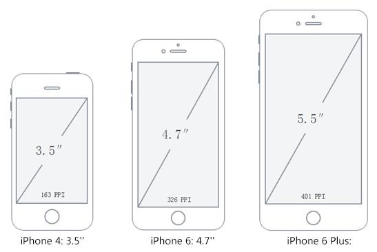
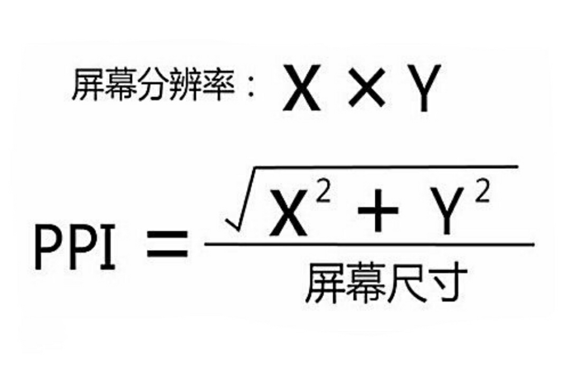
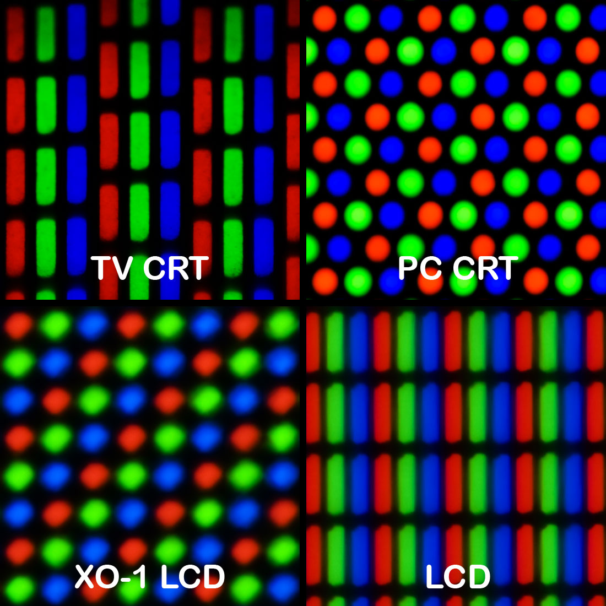
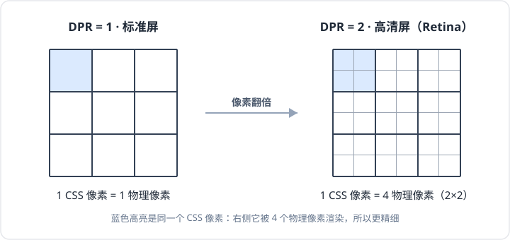
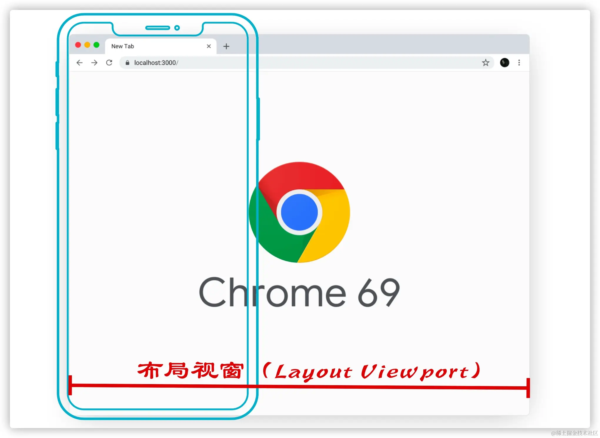
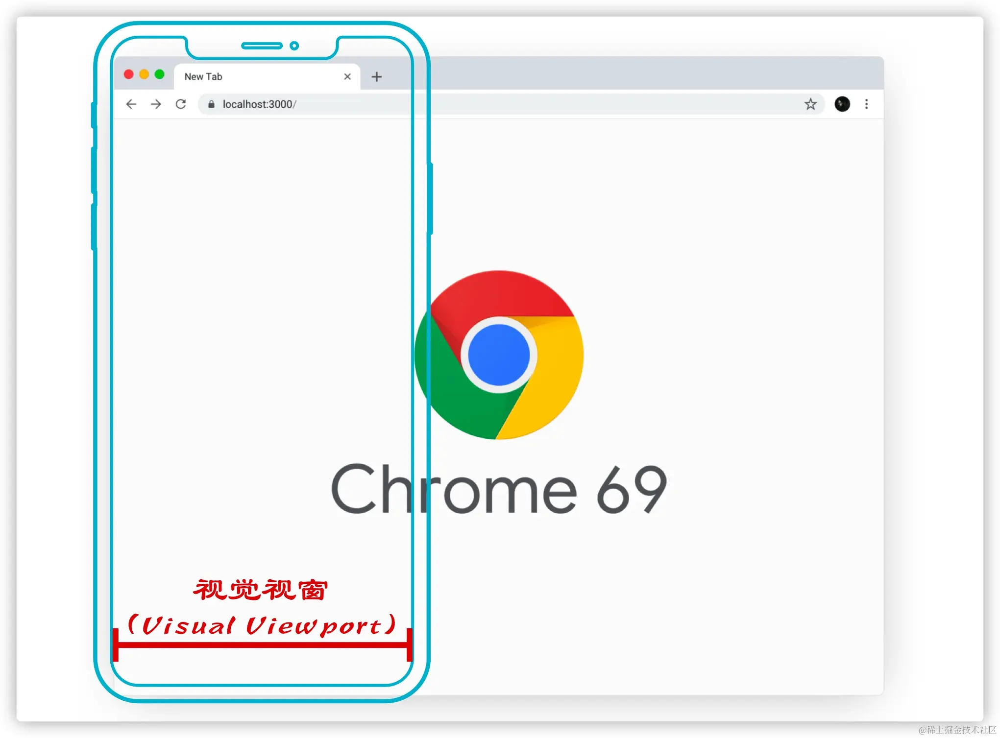
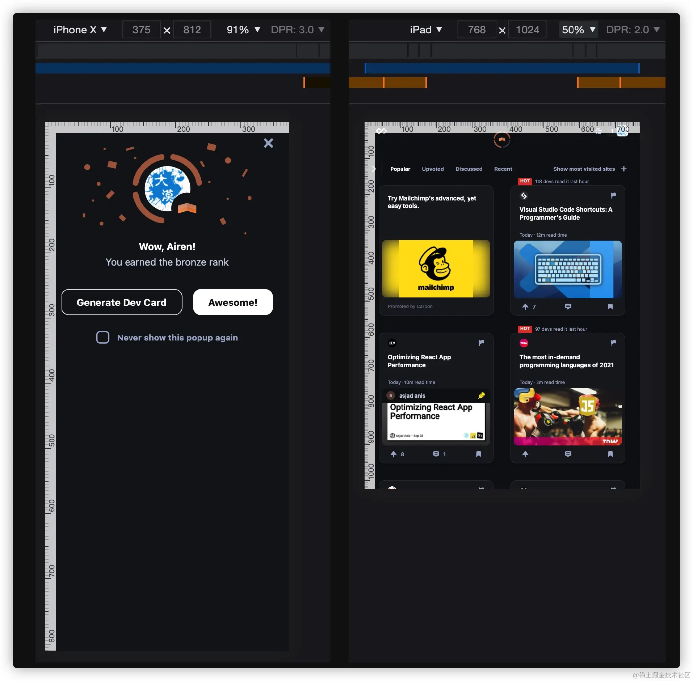
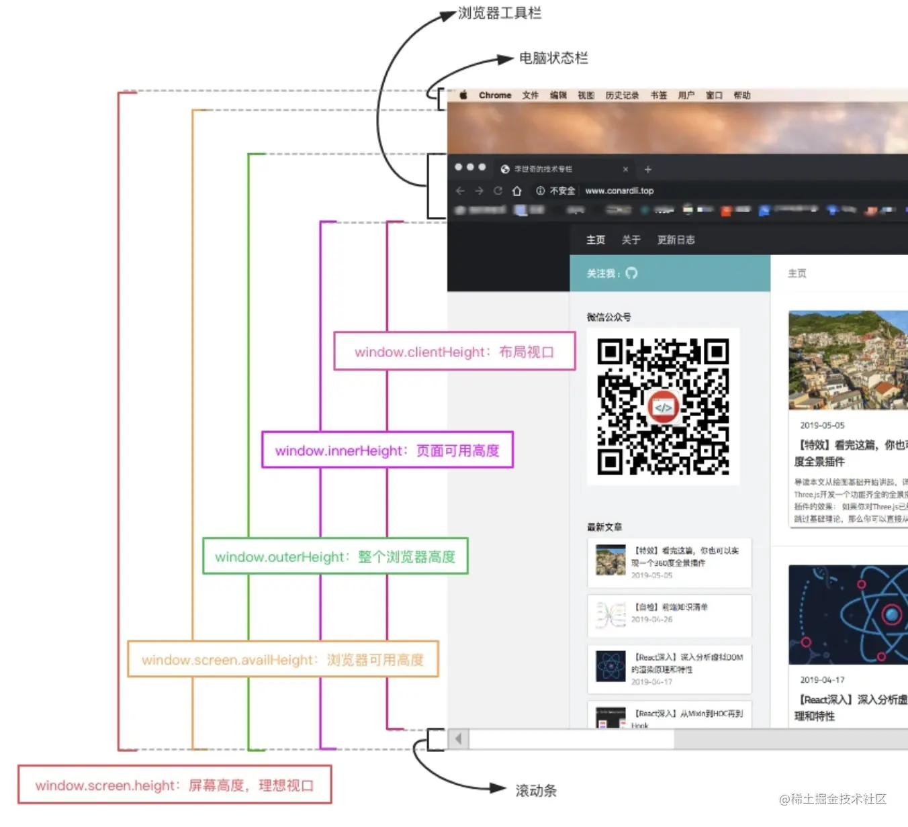

# 像素与视口

> [移动端适配 · 背景] 这一篇是[移动端适配](./case-mobile-h5.md)的前置概念参考——物理像素 / CSS 像素 / DPR、三视口、`meta viewport` 基本只在移动端适配里才用到，这里允许详尽。单位换算原理见[单位与等比还原](./units-and-scaling.md)，方法判断见[通用响应式方案](./general-responsive.md)。

## 核心结论

移动端适配最重要的是分清三件事：

```txt
物理像素：屏幕真实发光点
CSS 像素：CSS 布局使用的 px
DPR：物理像素 / CSS 像素
```

页面布局通常按 CSS 像素计算，而不是按物理像素计算。移动端必须设置基础 viewport：

```html
<meta name="viewport" content="width=device-width, initial-scale=1" />
```

## 必记关系

| 概念         | 重点                               |
| ------------ | ---------------------------------- |
| CSS 像素     | 页面布局使用的单位。               |
| 物理像素     | 屏幕硬件上的像素点。               |
| 设备独立像素 | 设备暴露给系统和浏览器的逻辑尺寸。 |
| DPR          | 一个 CSS 像素对应多少物理像素。    |
| 布局视口     | CSS 计算布局的视口。               |
| 视觉视口     | 用户当前实际看到的区域。           |
| 理想视口     | 移动端页面希望使用的布局宽度。     |

下面保留原整理内容，作为概念细节和历史设备数据参考。

## 屏幕相关概念

### 屏幕大小

屏幕大小指屏幕对角线长度，单位是英寸。常见尺寸有 3.5 寸、4.0 寸、5.0 寸、5.5 寸、6.0 寸等。



```txt
1 英寸 = 2.54 厘米
```

### 屏幕分辨率

屏幕分辨率是屏幕在横向、纵向上的物理像素点总数，一般用 `n * m` 表示。例如 iPhone 6 的屏幕分辨率为 `750 * 1334`。

注意点：

- 屏幕分辨率是固定值，无法修改。
- 屏幕分辨率和显示分辨率是两个概念，系统设置中可以修改的是显示分辨率。
- 屏幕分辨率通常大于或等于显示分辨率。

常见手机分辨率：

| 型号                | 分辨率       |
| ------------------- | ------------ |
| iPhone 3G / 3GS     | 320 \* 480   |
| iPhone 4 / 4s       | 640 \* 960   |
| iPhone 5 / 5s       | 640 \* 1136  |
| iPhone 6 / 7 / 8    | 750 \* 1334  |
| iPhone 6p / 7p / 8p | 1242 \* 2208 |
| iPhone X            | 1125 \* 2436 |
| 华为 P30            | 1080 \* 2340 |
| 华为 Mate40         | 2772 \* 1344 |
| 小米 10             | 2340 \* 1080 |
| 小米 11             | 3200 \* 1440 |

### 屏幕密度

屏幕密度又称屏幕像素密度，指屏幕每英寸包含的物理像素数量，单位是 `ppi`。`dpi` 的计算方式类似，但更多用于打印机、投影仪等场景。



## CSS 像素、设备像素和设备独立像素

### CSS 像素

CSS 像素是在 CSS 中以 `px` 为单位声明的长度。CSS 像素不是固定等于物理像素，它会受到设备像素密度、DPR、页面缩放等因素影响。

页面放大时，同一个 CSS 像素会跨越更多物理像素；页面缩小时，同一个屏幕区域能容纳更多 CSS 像素。

### 设备像素

设备像素又叫物理像素，指设备能控制显示的最小物理单位。屏幕在生产完成后，物理像素数量基本固定。

直观理解：

> 可以参考公园里的景观变色彩灯，一个物理像素由红、蓝、绿子像素组成，三种颜色不同亮度混合出各种色彩。



<small>不同显示技术下的像素 / 子像素几何（CRT 电视、CRT 显示器、笔记本 LCD、OLPC）。图：[Peter Halasz · CC BY-SA 3.0](https://commons.wikimedia.org/wiki/File:Pixel_geometry_01_Pengo.jpg)</small>

### 设备独立像素

设备独立像素简称 `DIP`，也叫密度无关像素或逻辑像素。它表示和设备密度解耦的逻辑尺寸。Web 中通常可以把未缩放状态下的 CSS 像素理解为设备独立像素。

核心解释：

- 高分辨率屏幕出现后，如果仍然让一个设计像素直接对应一个物理像素，同样的内容会在高分辨率设备上变得很小。
- Retina 屏幕把多个物理像素当作一个逻辑像素使用，让元素大小不变，但显示更精细。
- 在 iOS、Android 和 React Native 开发中，也存在类似的逻辑像素体系。



在 JavaScript 中可以通过以下方式查看屏幕逻辑宽高：

```js
window.screen.width;
window.screen.height;
```

## DPR 是什么？

DPR 是 `device pixel ratio`，设备像素比。常用公式是：

```txt
DPR = 设备像素 / 设备独立像素
```

**成因**：DPR 不是凭空的硬件常量，而是**物理像素**与**设备独立像素**之间的折算比率。高密度屏把多个物理像素并成一个 CSS 像素来用，于是设备“应有”的 CSS 排版宽度（即理想视口）就等于物理分辨率除以 DPR：

```txt
理想视口宽度 = 设备物理分辨率 / DPR
```

例如某屏 `1170` 物理像素、DPR 为 `3`，理想视口宽度就是 `1170 / 3 = 390` CSS px——这正是 `screen.width` 和 `device-width` 的值，中间没有第二个比率。

DPR 由**系统规定、可后期更改**：系统给设备设定的逻辑分辨率（“显示缩放 / 显示尺寸”等设置）一变，DPR 就跟着变，并非写死在硬件上。也正因如此，移动端用 `width=device-width` 把**布局视口对齐到理想视口**（见下文 [`meta viewport`](#meta-viewport)），CSS 排版、媒体查询和 `vw` 拿到的才是设备应有的宽度。完整推导见 [meta viewport 有什么作用？](https://questions.9shi.cc/html/viewport/meta-viewport)。

在 Web 中，浏览器提供了 `window.devicePixelRatio`：

```js
window.devicePixelRatio;
```

CSS 中可以用媒体查询区分 DPR：

```css
@media (-webkit-min-device-pixel-ratio: 2), (min-device-pixel-ratio: 2) {
}
```

常见设备示例：

| 型号                | 物理分辨率   | 设备独立像素 | DPR |
| ------------------- | ------------ | ------------ | --- |
| iPhone 3GS          | 320 \* 480   | 320 \* 480   | 1   |
| iPhone 4 / 4s       | 640 \* 960   | 320 \* 480   | 2   |
| iPhone 5 / 5s       | 640 \* 1136  | 320 \* 568   | 2   |
| iPhone 6 / 7 / 8    | 750 \* 1334  | 375 \* 667   | 2   |
| iPhone 6p / 7p / 8p | 1242 \* 2208 | 414 \* 736   | 3   |
| iPhone X            | 1125 \* 2436 | 375 \* 812   | 3   |
| 华为 P10            | 1080 \* 1920 | 360 \* 640   | 3   |

iPhone Plus 类设备存在一个例外：开发者工具中看到的设备独立像素和 DPR 相乘，可能得到的是一组“设计像素”，再由系统映射到真实物理像素上。开发时通常不需要关心底层压缩过程，仍按浏览器暴露的 CSS 像素、DPR 和视口宽度处理。

### 调大 DPR 为什么不会变高清

一个常见误区：在低分屏上把 DPR 调大（浏览器放大，或开发者工具里手动设），是不是就等于高清屏了？不能。清晰度的上限由**物理像素总数**决定，这是硬件固定的；DPR 只是“1 个 CSS 像素摊到几个物理像素”的**换算比 / 读数**，不是制造物理像素的开关。物理点不够，把 DPR 调大只是让浏览器以为有更多点可画、实际没有，于是内容只会被**放大、变糊**，不会变细。

同样是 `DPR=2`，真高清屏和低分屏“调”出来的完全是两回事：

|                    | 物理像素（决定清晰度） | 布局视口（CSS 宽） | 结果                             |
| ------------------ | ---------------------- | ------------------ | -------------------------------- |
| 真高清屏 DPR=2     | 1600（翻倍 ↑）         | 800（不变）        | 同样内容用 2× 物理点渲染→真清晰  |
| 低分屏放大到 DPR=2 | 800（没变）            | 400（减半 ↓）      | 同样内容铺更少 CSS 像素→放大更糊 |

差别就一句话：真高清是“物理像素翻倍、布局视口不变”，低分屏调 DPR 是“物理像素不变、布局视口减半”。前者加了细节，后者只是放大。

```
// 先改 DPR,视口是被动算出来的结果。
Ctrl + 缩放
   ↓
改变 DPR(CSS像素 ↔ 物理像素 的换算比)
   ↓
物理窗口宽度不变,但换算出的 CSS 像素总数变少
   ↓
理想视口(CSS px)变小
   ↓
布局视口跟随理想视口 → clientWidth 变小
```

**顺带厘清“放大 / 缩小”到底改了哪个视口**——PC 和移动端的缩放不是一回事：

| 操作                      | DPR      | 布局视口 `clientWidth` | 视觉视口 `visualViewport` | `screen.width` |
| ------------------------- | -------- | ---------------------- | ------------------------- | -------------- |
| PC 浏览器缩放 Ctrl`+`放大 | 变大 ↑   | 变小 ↓                 | 同布局视口                | 不变           |
| PC 浏览器缩放 Ctrl`-`缩小 | 变小 ↓   | 变大 ↑                 | 同布局视口                | 不变           |
| 移动端双指 pinch 放大     | **不变** | **不变**               | 变小 ↓、`scale` ↑         | 不变           |

关键对比：**PC 的 Ctrl 缩放改的是布局视口和 DPR**——所以放大时 `window.devicePixelRatio` 真的会变大，但屏幕物理像素没动，只是放大、不会变清晰；**移动端 pinch 改的是视觉视口**，布局视口和 DPR 岿然不动，所以双指放大网页不会触发重排，只是把“已经画好的画面”凑近看。

> **DPR > 1 是两个移动端经典问题的共同根因**：写出的 `1px` 被多个物理像素渲染所以“变粗”，低分辨率位图被多个物理像素近似填色所以“变糊”。根因到此为止；对应的解决方案（伪元素缩放、`@2x`/`srcset` 等）属于场景工程，见[移动端适配](./case-mobile-h5.md)。

## 三个视口

### 布局视口

布局视口是 CSS 布局计算使用的区域，单位是 CSS 像素。移动设备为了兼容旧桌面页面，默认可能设置一个较大的布局视口，例如 `980px`。



获取布局视口：

```js
document.documentElement.clientWidth;
document.documentElement.clientHeight;
```

显式设置布局视口可以使用 `meta viewport`：

```html
<meta name="viewport" content="width=400" />
```

### 视觉视口

视觉视口是用户当前真实看到的区域。用户缩放页面时，布局视口通常不变，但视觉视口会改变。



获取视觉视口：

```js
window.innerWidth;
window.innerHeight;
```

类比：

> 可以把 layout viewport 理解为一张白纸，把 visual viewport 理解为一个透视器。白纸大小不变，用户通过透视器靠近或远离，看到的内容变多或变少。

### 理想视口

设备出厂就固定的一个值,等于"屏幕物理宽度 ÷ 设备基准 DPR"。比如某手机物理 1080px、基准 DPR=3,理想视口就是 360 CSS px,这个值是死的,不随 pinch 变。

理想视口是移动端页面希望布局视口对齐的目标宽度。常用理解公式是：

```txt
理想视口宽度 = 移动设备横向分辨率 / DPR
```



可以通过 `screen.width` / `screen.height` 读取屏幕的 CSS 像素宽高：

```js
window.screen.width;
window.screen.height;
```

## `meta viewport`

移动设备默认的 viewport 可能是比屏幕更宽的布局视口。移动端页面通常需要使用 `meta viewport` 让布局视口对齐理想视口。

```html
<meta
  name="viewport"
  content="width=device-width, initial-scale=1, maximum-scale=1, user-scalable=no"
/>
```

字段说明：

| 字段            | 可能值                       | 描述                     |
| --------------- | ---------------------------- | ------------------------ |
| `width`         | 正整数或 `device-width`      | 定义布局视口宽度         |
| `height`        | 正整数或 `device-height`     | 定义布局视口高度         |
| `initial-scale` | `0.0` 到 `10.0`              | 定义页面初始缩放比例     |
| `minimum-scale` | `0.0` 到 `10.0`              | 定义允许缩放的最小值     |
| `maximum-scale` | `0.0` 到 `10.0`              | 定义允许缩放的最大值     |
| `user-scalable` | `yes` / `no`                 | 是否允许用户缩放         |
| `viewport-fit`  | `auto` / `contain` / `cover` | 控制安全区和全屏覆盖关系 |

注意事项：

- `width=device-width` 可以让布局视口宽度等于设备屏幕的 CSS 像素宽度。
- `initial-scale=1` 也会影响视口缩放，因此通常和 `width=device-width` 一起写。
- `viewport` 标签主要针对移动端浏览器。
- 即使设置了 `user-scalable=no`，某些浏览器仍可能基于可访问性策略允许用户缩放。

更推荐的基础写法是：

```html
<meta name="viewport" content="width=device-width, initial-scale=1" />
```

## 获取窗口大小



常用窗口尺寸：

- `document.documentElement.clientHeight`：布局视口高度，包括内边距，不包括垂直滚动条、边框和外边距。
- `document.documentElement.offsetHeight`：包括内边距、滚动条、边框。
- `document.documentElement.scrollHeight`：内容完整展示所需高度。
- `window.innerHeight`：视觉视口高度，包括滚动条。
- `window.outerHeight`：浏览器窗口外部高度，包括窗口边框等。
- `window.screen.height`：屏幕 CSS 像素高度，通常可理解为理想视口高度。
- `window.screen.availHeight`：浏览器窗口可用高度。

`window.innerWidth` 和 `document.documentElement.clientWidth` 的区别：

- `innerWidth` 包含滚动条宽度。
- `clientWidth` 不包含滚动条宽度。
- `innerWidth` 更关注当前浏览器窗口的视口。
- `clientWidth` 更适合参与页面布局判断。
