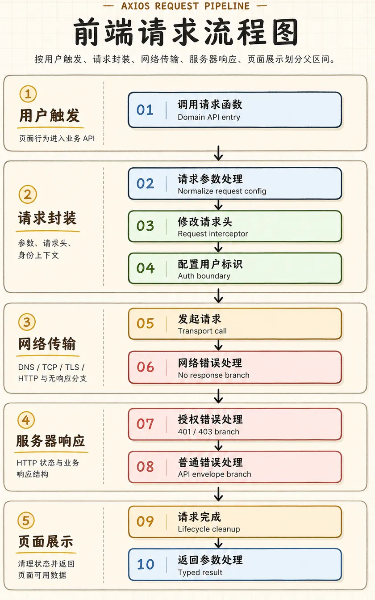

# Axios

## axios 二次封装

Axios 二次封装的目标不是把 Axios 再包一层，而是把项目里的请求约定集中起来：入口统一、返回结构统一、错误处理统一、登录态处理统一，并给业务代码保留清晰的类型。

### 1. 前端请求流程图



<style>
.axios-request-flow-image {
  display: block;
  width: min(100%, 560px);
  height: auto;
  margin: 16px auto 24px;
}
</style>

### 2. 基础封装（最小可用版本）

基础封装先解决最小闭环：创建实例、读取环境变量、带上公共请求信息、剥离响应数据、约定返回结构，并暴露常用请求方法。

- axios 实例（baseURL / timeout / headers）
- 环境变量管理 baseURL（dev / prod）
- 基础请求拦截器（携带 token、公共参数）
- 基础响应拦截器（数据剥壳、基础错误提示）
- 返回结构约定
- 类型声明与泛型返回
- get / post / put / delete 基础方法

::: code-group

```ts [http.ts]
import axios, {
  type AxiosInstance,
  type AxiosRequestConfig,
  type InternalAxiosRequestConfig,
} from "axios";

// 项目统一响应结构：服务端返回 { code, message, data }，业务代码只拿 data。
interface ApiResponse<T> {
  code: number;
  message: string;
  data: T;
}

type RequestConfig = AxiosRequestConfig & {
  // 静默请求：调用方可用它跳过全局错误提示或 loading。
  silent?: boolean;
  // 登录、刷新 token 等接口可跳过 Authorization 头。
  skipAuth?: boolean;
};

type InternalRequestConfig = InternalAxiosRequestConfig & RequestConfig;

class HttpClient {
  private instance: AxiosInstance;

  constructor() {
    this.instance = axios.create({
      // Vite 会按模式读取 .env.development / .env.production。
      // 示例：VITE_API_BASE_URL=/api 或 https://api.example.com。
      baseURL: import.meta.env.VITE_API_BASE_URL,
      timeout: 10000,
      headers: {
        "Content-Type": "application/json",
      },
    });

    this.setupInterceptors();
  }

  private setupInterceptors() {
    this.instance.interceptors.request.use((config: InternalRequestConfig) => {
      // config 是本次请求的完整配置对象；headers 只是 config 里的请求头部分。
      if (!config.skipAuth) {
        const token = localStorage.getItem("access_token");
        if (token) {
          // 修改请求头时，只改 config.headers，而不是把 config 当成 headers。
          config.headers.Authorization = `Bearer ${token}`;
        }
      }

      // 公共参数也可以在这里统一追加，例如 tenantId、locale、traceId。
      return config;
    });

    this.instance.interceptors.response.use(
      (response) => {
        const result = response.data as ApiResponse<unknown>;

        if (result.code !== 0) {
          // 基础错误提示放在这里；复杂错误归一化放到“拦截器进阶”。
          return Promise.reject(new Error(result.message || "请求失败"));
        }

        // 数据剥壳：调用 http.get<User>() 时，业务代码直接拿到 User。
        return result.data;
      },
      (error) => Promise.reject(error),
    );
  }

  get<T>(url: string, config?: RequestConfig): Promise<T> {
    return this.instance.get<unknown, T>(url, config);
  }

  post<T, D = unknown>(url: string, data?: D, config?: RequestConfig): Promise<T> {
    return this.instance.post<unknown, T, D>(url, data, config);
  }

  put<T, D = unknown>(url: string, data?: D, config?: RequestConfig): Promise<T> {
    return this.instance.put<unknown, T, D>(url, data, config);
  }

  delete<T>(url: string, config?: RequestConfig): Promise<T> {
    return this.instance.delete<unknown, T>(url, config);
  }
}

export const http = new HttpClient();

// 使用时在调用点传入泛型，而不是指望拦截器“自动推导”运行时数据类型。
interface User {
  id: number;
  name: string;
}

const user = await http.get<User>("/user/1");
```

```js [http.js]
import axios from "axios";

/**
 * 项目统一响应结构：服务端返回 { code, message, data }，业务代码只拿 data。
 * @template T
 * @typedef {{ code: number, message: string, data: T }} ApiResponse
 */

/**
 * @typedef {import("axios").AxiosRequestConfig & {
 *   silent?: boolean,
 *   skipAuth?: boolean
 * }} RequestConfig
 */

function createHttpClient() {
  const instance = axios.create({
    // Vite 会按模式读取 .env.development / .env.production。
    // 示例：VITE_API_BASE_URL=/api 或 https://api.example.com。
    baseURL: import.meta.env.VITE_API_BASE_URL,
    timeout: 10000,
    headers: {
      "Content-Type": "application/json",
    },
  });

  instance.interceptors.request.use((config) => {
    // config 是本次请求的完整配置对象；headers 只是 config 里的请求头部分。
    if (!config.skipAuth) {
      const token = localStorage.getItem("access_token");
      if (token) {
        // 修改请求头时，只改 config.headers，而不是把 config 当成 headers。
        config.headers.Authorization = `Bearer ${token}`;
      }
    }

    // 公共参数也可以在这里统一追加，例如 tenantId、locale、traceId。
    return config;
  });

  instance.interceptors.response.use(
    (response) => {
      /** @type {ApiResponse<unknown>} */
      const result = response.data;

      if (result.code !== 0) {
        // 基础错误提示放在这里；复杂错误归一化放到“拦截器进阶”。
        return Promise.reject(new Error(result.message || "请求失败"));
      }

      // 数据剥壳：调用方直接拿到业务数据。
      return result.data;
    },
    (error) => Promise.reject(error),
  );

  return {
    /**
     * @template T
     * @param {string} url
     * @param {RequestConfig} [config]
     * @returns {Promise<T>}
     */
    get(url, config) {
      return instance.get(url, config);
    },

    /**
     * @template T
     * @template D
     * @param {string} url
     * @param {D} [data]
     * @param {RequestConfig} [config]
     * @returns {Promise<T>}
     */
    post(url, data, config) {
      return instance.post(url, data, config);
    },

    /**
     * @template T
     * @template D
     * @param {string} url
     * @param {D} [data]
     * @param {RequestConfig} [config]
     * @returns {Promise<T>}
     */
    put(url, data, config) {
      return instance.put(url, data, config);
    },

    /**
     * @template T
     * @param {string} url
     * @param {RequestConfig} [config]
     * @returns {Promise<T>}
     */
    delete(url, config) {
      return instance.delete(url, config);
    },
  };
}

export const http = createHttpClient();
```

:::

### 3. 拦截器进阶

拦截器进阶处理的是跨请求的公共行为：请求标识、loading、错误归一化，以及登录态刷新。

#### 3.1 请求拦截器进阶

- 请求标识生成（为取消重复请求做铺垫）
- loading 统一管理

```ts
function getRequestKey(config: AxiosRequestConfig) {
  const { method, url, params, data } = config;
  return [method, url, JSON.stringify(params), JSON.stringify(data)].join("&");
}

let loadingCount = 0;

function showLoading() {
  loadingCount += 1;
  if (loadingCount === 1) {
    // openGlobalLoading();
  }
}

function hideLoading() {
  loadingCount = Math.max(loadingCount - 1, 0);
  if (loadingCount === 0) {
    // closeGlobalLoading();
  }
}
```

#### 3.2 响应拦截器进阶

- 错误归一化（HTTP 错误 / 业务错误 / 网络错误）
- token 无感刷新
  - 401 捕获与请求重放
  - 并发处理：多个 401 只刷新一次（等待队列）
  - 刷新失败兜底（退出登录）

```ts
type NormalizedError = {
  type: "http" | "business" | "network" | "cancel";
  status?: number;
  code?: number;
  message: string;
};

function normalizeError(error: unknown): NormalizedError {
  if (axios.isCancel(error)) {
    return { type: "cancel", message: "请求已取消" };
  }

  if (axios.isAxiosError(error)) {
    if (error.response) {
      return {
        type: "http",
        status: error.response.status,
        message: error.message,
      };
    }

    return {
      type: "network",
      message: "网络异常，请稍后重试",
    };
  }

  return {
    type: "business",
    message: error instanceof Error ? error.message : "请求失败",
  };
}
```

Token 无感刷新需要重点处理并发：不能每个 401 都刷新一次 token。

```ts
let isRefreshing = false;
let refreshQueue: Array<(token: string) => void> = [];

async function refreshToken() {
  const refreshTokenValue = localStorage.getItem("refresh_token");
  const result = await axios.post<{ accessToken: string }>("/auth/refresh", {
    refreshToken: refreshTokenValue,
  });

  localStorage.setItem("access_token", result.data.accessToken);
  return result.data.accessToken;
}

function replayWaitingRequests(token: string) {
  refreshQueue.forEach((resolve) => resolve(token));
  refreshQueue = [];
}

function logout() {
  localStorage.removeItem("access_token");
  localStorage.removeItem("refresh_token");
  // redirectToLogin();
}
```

响应拦截器中只保留流程骨架，具体的存储、跳转、提示逻辑交给项目能力处理。

```ts
this.instance.interceptors.response.use(
  (response) => response.data.data,
  async (error) => {
    const originalRequest = error.config;

    if (error.response?.status !== 401 || originalRequest._retry) {
      return Promise.reject(normalizeError(error));
    }

    originalRequest._retry = true;

    if (isRefreshing) {
      return new Promise((resolve) => {
        refreshQueue.push((token) => {
          originalRequest.headers.Authorization = `Bearer ${token}`;
          resolve(this.instance(originalRequest));
        });
      });
    }

    try {
      isRefreshing = true;
      const token = await refreshToken();
      replayWaitingRequests(token);
      originalRequest.headers.Authorization = `Bearer ${token}`;
      return this.instance(originalRequest);
    } catch (refreshError) {
      refreshQueue = [];
      logout();
      return Promise.reject(refreshError);
    } finally {
      isRefreshing = false;
    }
  },
);
```

### 4. 取消请求（基于 AbortController）

新版 Axios 推荐使用 `AbortController`，不再优先使用 `CancelToken`。

- 单个请求取消
- 重复请求取消（pendingMap，结合拦截器实现）
- 全部请求取消（路由切换场景）

#### 4.1 单个请求取消

```ts
const controller = new AbortController();

http.get<User[]>("/users", {
  signal: controller.signal,
});

controller.abort();
```

#### 4.2 重复请求取消

重复请求取消适合搜索、筛选、重复提交等场景。核心是用请求信息生成唯一 key，并在请求开始和结束时维护 `pendingMap`。

```ts
const pendingMap = new Map<string, AbortController>();

function addPendingRequest(config: AxiosRequestConfig) {
  const requestKey = getRequestKey(config);

  if (pendingMap.has(requestKey)) {
    pendingMap.get(requestKey)?.abort();
    pendingMap.delete(requestKey);
  }

  const controller = new AbortController();
  config.signal = controller.signal;
  pendingMap.set(requestKey, controller);
}

function removePendingRequest(config: AxiosRequestConfig) {
  const requestKey = getRequestKey(config);
  pendingMap.delete(requestKey);
}
```

```ts
this.instance.interceptors.request.use((config) => {
  addPendingRequest(config);
  return config;
});

this.instance.interceptors.response.use(
  (response) => {
    removePendingRequest(response.config);
    return response;
  },
  (error) => {
    if (error.config) {
      removePendingRequest(error.config);
    }

    return Promise.reject(error);
  },
);
```

#### 4.3 全部请求取消

全部取消通常用于路由切换、退出登录、关闭页面级弹窗等场景。

```ts
function cancelAllRequests() {
  pendingMap.forEach((controller) => controller.abort());
  pendingMap.clear();
}
```

注意事项：

1. 取消请求只是不再接收客户端响应，不代表服务端一定停止处理。
2. 取消异常需要单独识别，避免显示成普通错误。
3. 批量取消要保证幂等，重复调用不应该报错。

### 5. 可选增强

可选增强不要一开始就全部塞进基础封装。它们更适合在项目确实需要时按能力增量加入。

#### 5.1 接口缓存

接口缓存适合低频变化的数据，例如字典、配置项、静态枚举。缓存 key 可以复用请求标识。

```ts
const cacheMap = new Map<string, { expireAt: number; data: unknown }>();

function getCache<T>(key: string): T | undefined {
  const cached = cacheMap.get(key);
  if (!cached || cached.expireAt < Date.now()) {
    cacheMap.delete(key);
    return undefined;
  }

  return cached.data as T;
}

function setCache(key: string, data: unknown, ttl = 60_000) {
  cacheMap.set(key, {
    data,
    expireAt: Date.now() + ttl,
  });
}
```

#### 5.2 失败重试

重试适合网络抖动、幂等 GET 请求、短暂服务不可用。不要默认重试非幂等写请求。

```ts
async function retry<T>(task: () => Promise<T>, max = 2): Promise<T> {
  let lastError: unknown;

  for (let index = 0; index <= max; index += 1) {
    try {
      return await task();
    } catch (error) {
      lastError = error;
    }
  }

  throw lastError;
}
```

#### 5.3 上传 / 下载（进度回调）

上传和下载通常需要单独暴露方法，因为它们的响应类型、进度事件和错误提示方式不同于普通 JSON 请求。

```ts
function upload<T>(url: string, file: File, onProgress?: (percent: number) => void) {
  const formData = new FormData();
  formData.append("file", file);

  return http.post<T, FormData>(url, formData, {
    headers: {
      "Content-Type": "multipart/form-data",
    },
    onUploadProgress(event) {
      if (event.total) {
        onProgress?.(Math.round((event.loaded / event.total) * 100));
      }
    },
  });
}
```

### 参考资料

> [Juejin: Axios 封装方案](https://juejin.cn/post/7124573626161954823)
>
> [blog/docs/ts/axios.md at master · kvchen95/blog](https://github.com/kvchen95/blog/blob/master/docs/ts/axios.md)
>
> [基于 Axios 封装一个完美的双 token 无感刷新 - 掘金](https://juejin.cn/post/7271139265442021391)
>
> https://mp.weixin.qq.com/s/7ZjF2ZtDShC9UiWOTjxm4Q
>
> https://mp.weixin.qq.com/s/LHDd3Tol0JIORdMfFpZKaA
